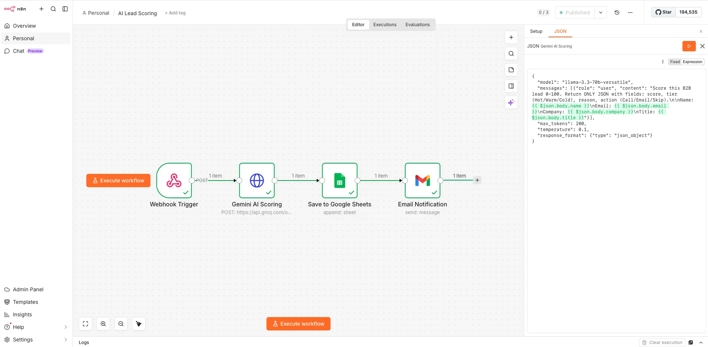

# AI Lead Scoring Automation — n8n + Groq AI

An intelligent lead scoring workflow that uses **Groq AI (Llama 3.3 70B)** to automatically analyze, score, and prioritize incoming leads in real-time.

## Workflow Screenshot

## What It Does

1. **Webhook** receives a new lead (Name, Email, Company, Job Title)
2. **Groq AI (Llama 3.3 70B)** analyzes the lead and returns a score (0–100), tier (Hot/Warm/Cold), reasoning, and recommended action
3. **Google Sheets** stores the lead with AI-generated score and tags
4. **Gmail** sends an instant notification with the lead summary

## Tech Stack

- **n8n** — workflow automation
- **Groq API** (llama-3.3-70b-versatile) — AI scoring
- **Google Sheets** — lead database
- **Gmail** — notifications

## Webhook Input

## AI Output Example

## Production Webhook

{"message":"Workflow was started"}

---
Built by [Dilovar Sam](https://github.com/dsam-ai) | AI & Automation Freelancer
